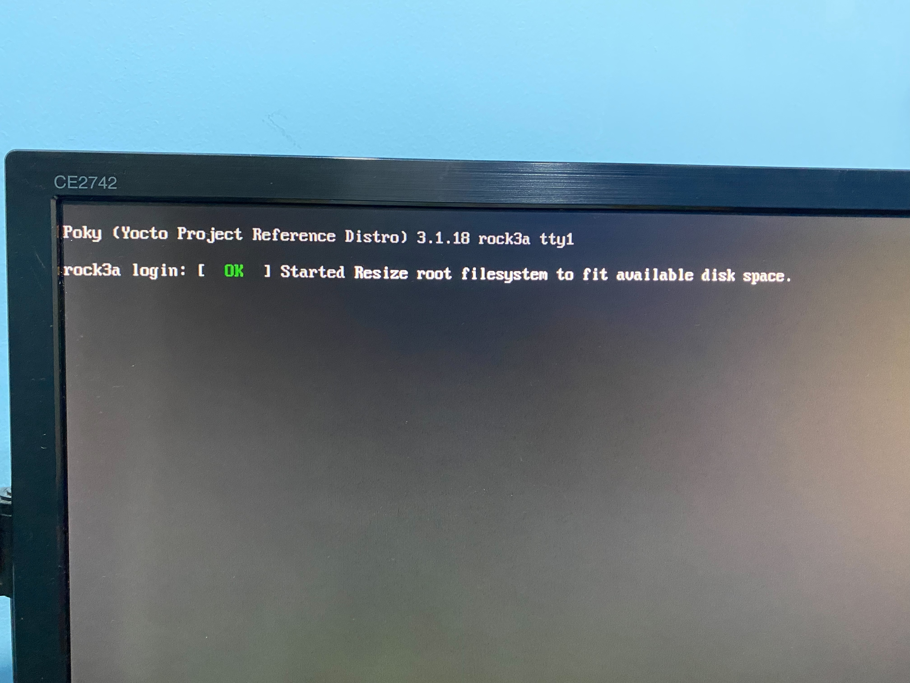

# Porting Rock3A rockchip-bsp to Yocto Project
{: .no_toc }

## Table of contents
{: .no_toc }

1. TOC
{:toc}

-----------------------------------

## Rockchip Debian SDK

[https://wiki.radxa.com/Rock3/dev/Debian](https://wiki.radxa.com/Rock3/dev/Debian)

## Yocto Layer for Radxa Boards (Not support Rock3A-RK3568 yet)

[https://wiki.radxa.com/Yocto-layer-for-radxa-boards](https://wiki.radxa.com/Yocto-layer-for-radxa-boards)

## My pull request for Yocto Rock3A-RK3568 porting

[https://github.com/radxa/meta-radxa/pull/29](https://github.com/radxa/meta-radxa/pull/29)

## Porting's test result

### Desktop image (radxa-desktop-image)

### Consolse Image (radxa-console-image)

